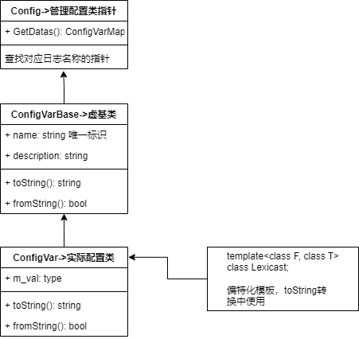

### 模板

#### 类图


#### 偏特化
```cpp
template<class T, class FromStr = LexicalCast<std::string, T>, 
                  class ToStr = LexicalCast<T, std::string>>
class ConfigVar : public ConfigVarBase;

template<class F, class T>
class LexicalCast
{
public:
    T operator()(const F& v)
    {
        return boost::lexical_cast<T>(v);
    }
};

template<class T>
class LexicalCast<std::string, std::vector<T>>
{
public:
    std::vector<T> operator() (const std::string& v)
    {
    }
};

template<class T>
class LexicalCast<std::vector<T>, std::string>
{
public:
    std::string operator() (const std::vector<T>& v)
    {
    }
};

```

#### 重点内容
1. 监听日志变化更新机制->回调函数addListener()  
2. 全局静态变量map保存日志器对象，为保证在使用其他静态函数或变量前map初始化  
```cpp
static map<> GetDatas()
{
    static map<> s_dats;
    return s_datas;
}
```
3. LogIniter
```cpp
static LogIniter __log_init;
```
程序启动在读取本地配置yaml文件前，需要监听日志配置是否变化  
为此定义出```LogAppenderDefine```和```LogDefine```以及对应偏特化类，保证在日志读取本地配置文件时能够监听到变化


#### 学习点
1. 模板使用，特化、偏特化以及全特化
2. 配置系统设计思路
3. 回调机制使用
4. 各变量初始化时机以及使用时机
