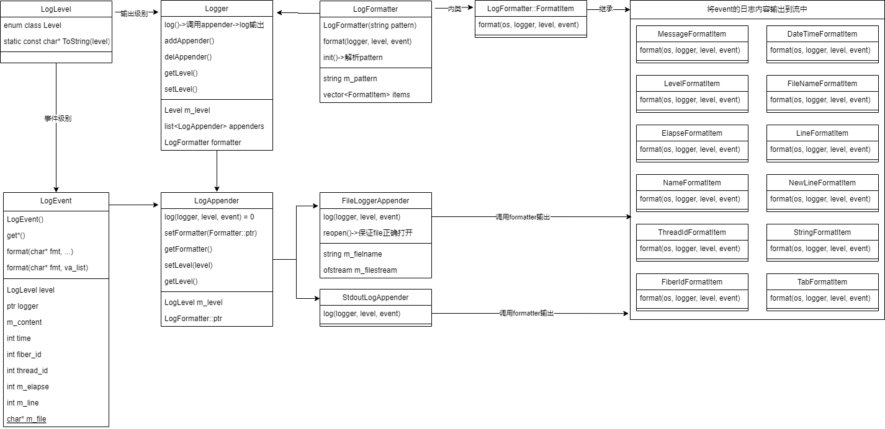

## 日志系统

LogLevel：日志级别  
LogEvent：日志事件，日志输出的内容信息等  
LogEventWrap：管理日志事件，RAII机制  
LogFormatter：日志格式器  
LogAppender：日志输出地  
Logger：日志输出器  

### 类图


### 执行流程
logger初始化：new LogFormatter->init()：解析模板，回调函数返回的对象指针保存在m_items  
logger->log(level, event)：遍历成员appenders，appender->log(logger, level, event)->调用formatter的format->遍历m_items，指针调用format返回正确的日志流

### 新用法
```cpp
switch (level)
    {
#define XX(name) \
    case LogLevel::Level::name: \
        return #name; \
        break;
    
    XX(DEBUG);
    XX(INFO);
    XX(WARN);
    XX(ERROR);
    XX(FATAL);
#undef XX
    default:
        return "UNKNOW";
    }
```
```cpp
static std::map<std::string, std::function<FormatItem::ptr(const std::string& str)>> s_format_items = {
#define XX(str, C) \
        {#str, [](const std::string& fmt) { return FormatItem::ptr(new C(fmt)); }}

        XX(m, MessageFormatItem),
        XX(p, LevelFormatItem),
        XX(r, ElapseFormatItem),
        XX(c, NameFormatItem),
        XX(t, ThreadIdFormatItem),
        XX(n, NewLineFormatItem),
        XX(d, DateTimeFormatItem),
        XX(f, FilenameFormatItem),
        XX(l, LineFormatItem),
        XX(T, TabFormatItem),
        XX(F, FiberIdFormatItem),
#undef XX
    };
```